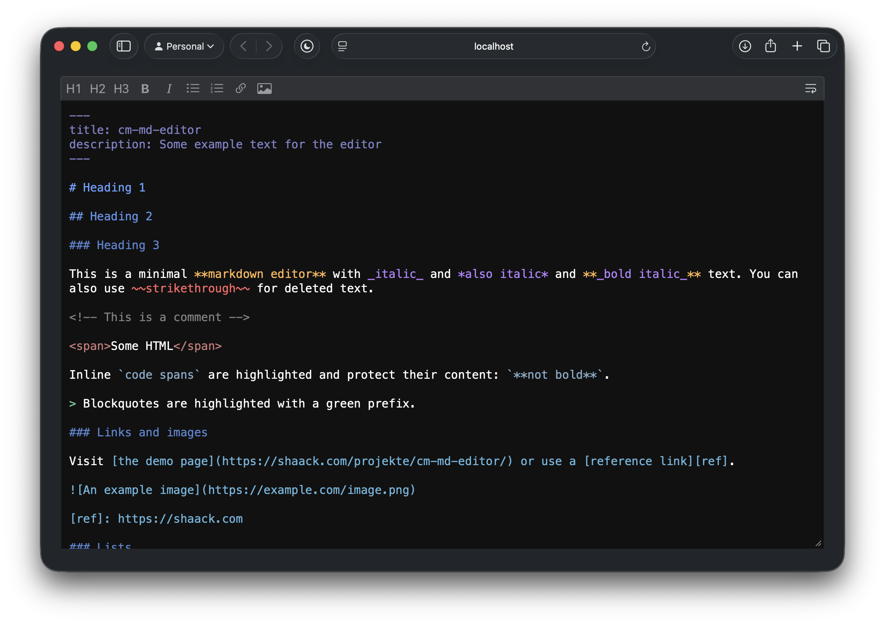

# cm-md-editor

A minimal, dependency-free markdown editor as a vanilla JavaScript ES6 module.

[Demo](https://shaack.com/projekte/cm-md-editor/)



## Key features

- Vanilla JavaScript module, zero dependencies
- Syntax highlighting for headings, bold, italic, strikethrough, highlight, code, lists, links, images, blockquotes, HTML tags, horizontal rules, front matter and more
- Bare `http(s)` URLs are auto-detected, underlined, and protected from markdown formatting (e.g. underscores in a URL stay literal)
- Modular toolbar built from composable tools
- Word wrap toggle with persistent state (localStorage)
- List mode: Tab/Shift-Tab to indent/outdent, auto-continuation on Enter
- Move lines up/down with Alt+Up/Down (works on any line, not just list items)
- Bold with Ctrl/Cmd+B, italic with Ctrl/Cmd+I (provided by tools)
- Native undo/redo support (Ctrl/Cmd+Z / Ctrl/Cmd+Shift+Z)
- Lightweight, fast, easy to use

## Installation

```bash
npm install cm-md-editor
```

## Usage

```html
<textarea id="editor"></textarea>

<script type="module">
    import {MdEditor} from "cm-md-editor/src/MdEditor.js"

    const editor = new MdEditor(document.getElementById("editor"))
</script>
```

This creates an editor with the default toolbar: Headings (h1–h3), Bold, Italic, Strikethrough, Highlight, Unordered List, Ordered List, Insert Link, Insert Image.

### Custom toolbar

Compose your own toolbar by passing a `tools` array:

```javascript
import {MdEditor} from "cm-md-editor/src/MdEditor.js"
import {Headings} from "cm-md-editor/src/tools/Headings.js"
import {Bold} from "cm-md-editor/src/tools/Bold.js"
import {Italic} from "cm-md-editor/src/tools/Italic.js"
import {Separator} from "cm-md-editor/src/tools/Separator.js"
import {InsertLink} from "cm-md-editor/src/tools/InsertLink.js"

new MdEditor(document.getElementById("editor"), {
    tools: [Headings, Separator, Bold, Italic, Separator, InsertLink]
})
```

### Configuring tools

Tools that accept options can be passed as `[ToolClass, props]` tuples:

```javascript
new MdEditor(document.getElementById("editor"), {
    tools: [[Headings, {minLevel: 2, maxLevel: 4}], Bold, Italic]
})
```

## Configuration (props)

All props are optional. Pass them as the second argument to the constructor.

| Prop | Type | Default | Description |
|------|------|---------|-------------|
| `tools` | `array` | `defaultTools` | Array of tool classes (or `[class, props]` tuples). See [Tools](#tools) |
| `wordWrap` | `boolean` | `true` | Default word wrap state. Overridden by localStorage if the user has toggled it |
| `listIndent` | `string` | `"    "` (four spaces) | One level of list indentation, inserted/removed with Tab/Shift-Tab on a list line. Tabs and two-space levels are still accepted when reading existing text |
| `iconsPath` | `string` | bundled `src/tools/icons/` | Base URL for tool icon files referenced by `iconFile`. Resolved via `import.meta.url` by default |
| `colorChrome` | `string` | `"128,128,128"` | RGB tint for the toolbar chrome (background, borders, separators, button hover), applied at low alpha |
| `colorHeading` | `string` | `"100,160,255"` | RGB color for headings |
| `colorCode` | `string` | `"130,170,200"` | RGB color for code spans and fenced code blocks |
| `colorComment` | `string` | `"128,128,128"` | RGB color for HTML comments |
| `colorLink` | `string` | `"100,180,220"` | RGB color for links and images |
| `colorBlockquote` | `string` | `"100,200,150"` | RGB color for blockquote prefixes |
| `colorList` | `string` | `"100,200,150"` | RGB color for list markers |
| `colorStrikethrough` | `string` | `"255,100,100"` | RGB color for ~~strikethrough~~ |
| `colorHighlight` | `string` | `"230,200,90"` | RGB color for ==highlight== |
| `colorBold` | `string` | `"255,180,80"` | RGB color for **bold** |
| `colorItalic` | `string` | `"180,130,255"` | RGB color for _italic_ |
| `colorHtmlTag` | `string` | `"100,160,255"` | RGB color for HTML tag names |
| `colorHtmlTagBracket` | `string` | `"100,200,150"` | RGB color for HTML tag syntax characters (`< / > = " '`) |
| `colorHtmlTagAttribute` | `string` | `"180,130,255"` | RGB color for HTML attribute names |
| `colorHtmlTagValue` | `string` | `"255,180,80"` | RGB color for HTML attribute values |
| `colorHorizontalRule` | `string` | `"128,128,200"` | RGB color for horizontal rules |
| `colorEscape` | `string` | `"128,128,128"` | RGB color for escape sequences |
| `colorFrontMatter` | `string` | `"128,128,200"` | RGB color for YAML front matter |

Colors are specified as RGB strings (e.g. `"255,180,80"`). Syntax colors render at full opacity (headings fade slightly per level); `colorChrome` is applied at low alpha.

## Tools

The toolbar is built entirely from tools. Each tool is a class that provides toolbar buttons, keyboard shortcuts, and/or syntax highlighting extensions.

### Built-in tools

| Tool | Buttons | Shortcut | Description |
|------|---------|----------|-------------|
| `Headings` | h1, h2, h3 | — | Toggle heading levels. Props: `{minLevel, maxLevel}` (defaults: 1–3) |
| `Bold` | bold | Ctrl/Cmd+B | Toggle bold (`**`) |
| `Italic` | italic | Ctrl/Cmd+I | Toggle italic (`_`) |
| `Strikethrough` | strikethrough | — | Toggle strikethrough (`~~`) |
| `Highlight` | highlight | — | Toggle highlight (`==`) |
| `UnorderedList` | ul | — | Toggle unordered list prefix (`- `) |
| `OrderedList` | ol | — | Toggle ordered list prefix (`1. `) |
| `InsertLink` | link | — | Insert markdown link |
| `InsertImage` | image | — | Insert markdown image |
| `Separator` | — | — | Visual divider in the toolbar. Can be used multiple times |

All built-in tools are exported from `src/tools/DefaultTools.js`:

```javascript
import {defaultTools} from "cm-md-editor/src/tools/DefaultTools.js"
```

The default toolbar order is:

```
Headings | Bold, Italic, Strikethrough, Highlight | UnorderedList, OrderedList | InsertLink, InsertImage
```

### Writing a custom tool

A tool is a class that receives the editor instance (and optional props) in its constructor. It can implement any combination of three optional methods — **all three are optional**, and a tool may implement just one of them:

- `toolbarButtons()` — add buttons to the toolbar. **Optional**: a tool does not have to contribute a button.
- `keyboardShortcuts()` — register Ctrl/Cmd shortcuts.
- `highlightInline(html)` — extend the syntax highlighting.

Because every method is optional, a tool can do **pure syntax highlighting**: implement only `highlightInline(html)` and no `toolbarButtons()` / `keyboardShortcuts()`. Such a tool adds no toolbar chrome at all and only colors matching syntax in the editor.

```javascript
export class MyTool {
    constructor(editor, props = {}) {
        this.editor = editor
    }

    // Optional: add buttons to the toolbar
    toolbarButtons() {
        return [{
            name: 'mytool',
            title: 'My Tool',
            // Icon options (use one):
            icon: '<path d="..."/>',       // inline SVG path for a 16x16 viewBox
            iconFile: 'my-icon.svg',       // filename in src/tools/icons/
            iconUrl: 'https://...',        // full URL to an SVG file
            action: () => { /* ... */ }
        }]
    }

    // Optional: register keyboard shortcuts
    keyboardShortcuts() {
        return [{
            key: 'e',            // the key to match (KeyboardEvent.key)
            ctrlOrMeta: true,    // require Ctrl (Windows/Linux) or Cmd (Mac)
            action: (e) => { /* ... */ }
        }]
    }

    // Optional: extend syntax highlighting (receives already-escaped HTML)
    highlightInline(html) {
        return html.replace(...)
    }
}
```

#### Highlight-only tool (no toolbar button)

Since every method is optional, a tool that only implements `highlightInline(html)` adds no button and just colors matching syntax. `highlightInline` receives the already-escaped HTML of the line (it may already contain `<span>` tags from the built-in rules) and returns the modified HTML — so match on the text and leave existing tags intact:

```javascript
export class HashtagHighlight {
    constructor(editor, props = {}) {
        this.editor = editor
        this.color = props.color || "180,130,255"
    }

    // No toolbarButtons() and no keyboardShortcuts() — pure syntax highlighting.
    highlightInline(html) {
        // Only touch the plain-text slices between tags, never a <span>'s attributes.
        return html.replace(/<[^>]*>|[^<]+/g, (chunk) =>
            chunk[0] === "<" ? chunk : chunk.replace(/#(\w+)/g,
                (_, tag) => `<span style="color:rgba(${this.color},1)">#${tag}</span>`))
    }
}
```

For tools with co-located icons, use `import.meta.url` to resolve the icon path:

```javascript
toolbarButtons() {
    return [{
        name: 'mytool',
        title: 'My Tool',
        iconUrl: new URL("my-icon.svg", import.meta.url).href,
        action: () => { /* ... */ }
    }]
}
```

### Editor API available to tools

These public methods and properties are available via `this.editor`:

| Method / Property | Description |
|-------------------|-------------|
| `editor.element` | The textarea element (read `value`, `selectionStart`, `selectionEnd`) |
| `editor.insertTextAtCursor(text)` | Insert text at cursor, preserving native undo/redo |
| `editor.getCurrentLineInfo()` | Returns `{lineStart, lineEnd, line}` for the current line |
| `editor.selectLineRange(start, end)` | Set the textarea selection range |
| `editor.toggleWrap(marker)` | Toggle wrapping markers around the selection (e.g. `**` for bold) |
| `editor.escapeHtml(str)` | Escape a string for use in the highlight layer |
| `editor.colorSpan(colorProp, content)` | Wrap content in a colored `<span>` using an RGB color prop |

### Example: DummyText tool

A complete, self-contained tool that adds a toolbar button which inserts lorem
ipsum text at the cursor. The full source lives in
`example-addon-tools/DummyText.js`; its shape is:

```javascript
export class DummyText {
    constructor(editor) {
        this.editor = editor
    }

    // A single toolbar button. The icon ships next to the tool and is resolved
    // relative to this file via import.meta.url.
    toolbarButtons() {
        const iconUrl = new URL("bi-body-text.svg", import.meta.url).href
        return [{
            name: "dummy-text",
            title: "Insert dummy text",
            iconUrl: iconUrl,
            action: () => this.insertDummyText()
        }]
    }

    // The button's action uses the editor API to insert text at the cursor,
    // keeping the native undo/redo stack intact.
    insertDummyText() {
        const input = prompt("Word count (1–100):", "20")
        if (input === null) return
        const count = Math.max(1, Math.min(100, parseInt(input) || 20))
        this.editor.insertTextAtCursor(generateDummyText(count))
    }
}
```

Register it by adding the class to the `tools` array:

```javascript
import {MdEditor} from "cm-md-editor/src/MdEditor.js"
import {defaultTools} from "cm-md-editor/src/tools/DefaultTools.js"
import {Separator} from "cm-md-editor/src/tools/Separator.js"
import {DummyText} from "./example-addon-tools/DummyText.js"

new MdEditor(document.getElementById("editor"), {
    tools: [...defaultTools, Separator, DummyText]
})
```

## Keyboard shortcuts

| Shortcut | Action | Provided by |
|----------|--------|-------------|
| Ctrl/Cmd + B | Toggle bold | `Bold` tool |
| Ctrl/Cmd + I | Toggle italic | `Italic` tool |
| Tab | Indent list item or insert tab | Core editor |
| Shift + Tab | Outdent list item | Core editor |
| Alt + ↑ / ↓ | Move the current line(s) up or down | Core editor |
| Enter | Auto-continue list (unordered and ordered) | Core editor |
| Ctrl/Cmd + Z | Undo | Core editor |
| Ctrl/Cmd + Shift + Z (or Ctrl + Y) | Redo | Core editor |

## Testing

Unit tests use [Teevi](https://github.com/shaack/teevi) and run in a real browser. Open `test/index.html` in a browser for the report, or run a headless Chrome pass:

```bash
npm install -g puppeteer   # once, provides the headless runner
npm run test:headless
```

## License

MIT
